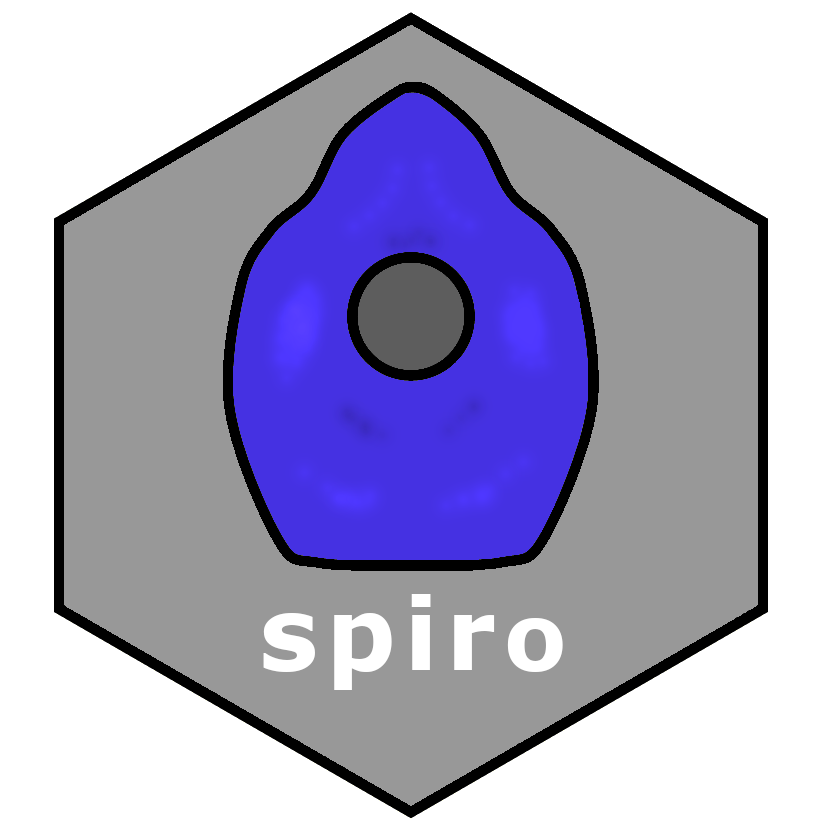
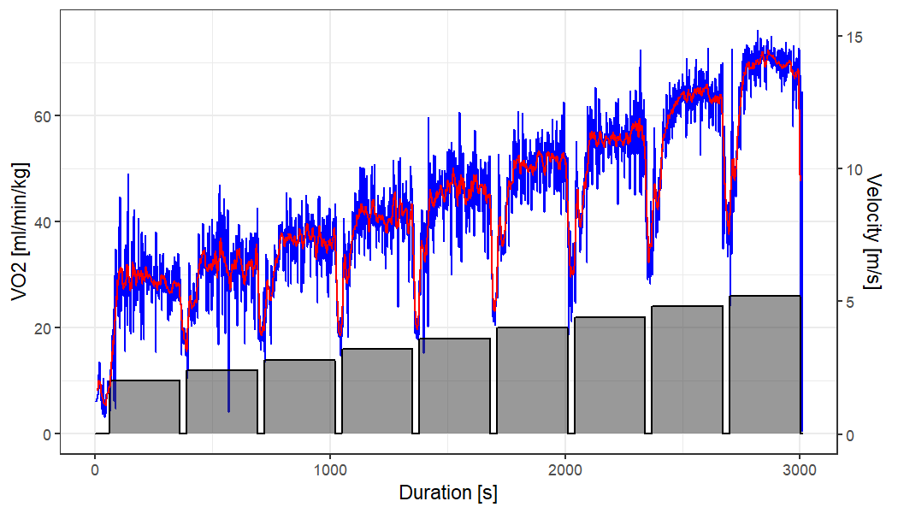

<!-- README.md is generated from README.Rmd. Please edit that file -->

# spiro 

<!-- badges: start -->

[](https://www.repostatus.org/#wip)
[](https://CRAN.R-project.org/package=spiro)
[](https://zenodo.org/badge/latestdoi/354232342)
[](https://github.com/smnnlt/spiro/actions)
[](https://codecov.io/gh/smnnlt/spiro)
[](https://github.com/ropensci/software-review/issues/541)
<!-- badges: end -->

## Overview

This R package offers a fast, standardized and reproducible workflow for
data from cardiopulmonary exercise testing. It offers tools for data
import, processing, summary and visualization.

> WARNING: This package is currently under active development. At the
> moment, I recommend to use it for demonstration or testing purposes
> only. When using `spiro` for scientific analyses, make sure to state
> the exact package version, as at this stage of development the
> package’s functions may undergo major changes.

## Background

Measuring gas exchange during physical exercise is a common procedure in
sports science and medicine. It allows to assess the functional limit of
the cardiovascular system, evaluate the success of training
interventions, and diagnose cardio-respiratory diseases. The measuring
devices of cardiopulmonary exercise testing — so-called metabolic carts
— output their data in different formats. Moreover, measured
breath-by-breath data is noisy and requires post-processing. This
package standardizes the import and processing of raw data from
different metabolic carts.

## Installation

Install the current development version from GitHub:

``` r
if (!require(remotes)) install.packages("remotes")
remotes::install_github("smnnlt/spiro")
```

Install the latest version 0.0.5 release by running this code:

``` r
if (!require(remotes)) install.packages("remotes")
remotes::install_github("smnnlt/spiro@v0.0.5")
```

## Usage

Main functions:

-   Use `spiro()` to automatically import and process raw data from
    cardiopulmonary exercise testing.
-   Use `spiro_summary()` for a summary of cardiopulmonary parameters
    (e.g., relative oxygen uptake, respiratory quotient, heart rate, …)
    for each load step.
-   Use `spiro_max()` to calculate maximum parameter values (e.g.,
    VO2max).
-   Use `spiro_plot()` to visualize the data as a modifiable Wassermann
    9-Panel Plot.

Further functionality:

-   Add external heart rate data from a .tcx file.
-   Automated guessing or manual setting of exercise protocols.
-   Different data filtering strategies for VO<sub>2max</sub>
    determination (moving time averages, moving breath averages,
    Butterworth filters)

#### Metabolic Carts

The following metabolic carts are currently supported by `spiro`:

-   Cortex
-   Cosmed
-   Vyntus
-   ZAN

Support for further metabolic carts is planned for future releases.

## Example

``` r
library(spiro)

# get data path for example
file <- spiro_example("zan_gxt")

# import and process the raw data
gxt_data <- spiro(file)

# summary of parameters by load step
spiro_summary(gxt_data)
#> for pre-measures, interval was set to length of measures (60 seconds)
#>    step_number duration load     VO2    VCO2     VE HR PetO2 PetCO2 VO2_rel
#> 1            0       60  0.0  500.19  411.74  13.03 NA    NA     NA    7.58
#> 2            1      300  2.0 1860.92 1585.75  39.87 NA    NA     NA   28.20
#> 3            2      300  2.4 2097.82 1805.27  44.63 NA    NA     NA   31.79
#> 4            3      300  2.8 2413.01 2122.17  52.63 NA    NA     NA   36.56
#> 5            4      300  3.2 2710.68 2319.93  57.19 NA    NA     NA   41.07
#> 6            5      300  3.6 3048.75 2684.87  67.45 NA    NA     NA   46.19
#> 7            6      300  4.0 3404.02 3026.70  75.91 NA    NA     NA   51.58
#> 8            7      300  4.4 3724.37 3383.64  88.36 NA    NA     NA   56.43
#> 9            8      300  4.8 4223.82 3993.55 106.44 NA    NA     NA   64.00
#> 10           9      300  5.2 4573.91 4488.36 127.54 NA    NA     NA   69.30
#>        RE  RER  CHO   FO
#> 1      NA 0.82 0.27 0.15
#> 2  234.97 0.85 1.27 0.46
#> 3  220.73 0.86 1.51 0.49
#> 4  217.62 0.88 1.95 0.48
#> 5  213.91 0.86 1.89 0.65
#> 6  213.86 0.88 2.47 0.60
#> 7  214.90 0.89 2.90 0.62
#> 8  213.75 0.91 3.50 0.56
#> 9  222.21 0.95 4.68 0.37
#> 10 222.12 0.98 5.82 0.12

# maximum values
spiro_max(gxt_data)
#>       VO2    VCO2     VE VO2_rel  RER HR
#> 1 4732.28 4640.75 129.62    71.7 0.99 NA

# Wassermann 9-Panel Plot
spiro_plot(gxt_data)
```



## Citation

``` r
citation("spiro")
#> 
#> To cite spiro in publications use:
#> 
#>   Simon Nolte (2022). spiro: Manage Data from Cardiopulmonary Exercise
#>   Testing. R package version 0.0.5.9000. DOI: 10.5281/zenodo.1040727.
#>   https://smnnlt.github.io/spiro/
#> 
#> A BibTeX entry for LaTeX users is
#> 
#>   @Manual{,
#>     title = {spiro: Manage Data from Cardiopulmonary Exercise Testing},
#>     author = {Simon Nolte},
#>     year = {2022},
#>     url = {https://smnnlt.github.io/spiro/},
#>     doi = {10.5281/zenodo.5816170},
#>     note = {R package version 0.0.5.9000},
#>   }
```

## Related Work

The [whippr](https://github.com/fmmattioni/whippr) package offers a
different approach to working with data from cardiopulmonary exercise
testing. It additionally offers functions for analyzing VO2 kinetics.

## Acknowledgment

The following persons contributed to this package by providing raw data
files: Daniel Appelhans, Sebastian Mühlenhoff, Yannick Schwarz, Adrian
Swoboda, Andreas Wagner.

## Contributing

If you consider contributing to this package, read the
[CONTRIBUTING.md](https://github.com/smnnlt/spiro/blob/main/.github/CONTRIBUTING.md).
