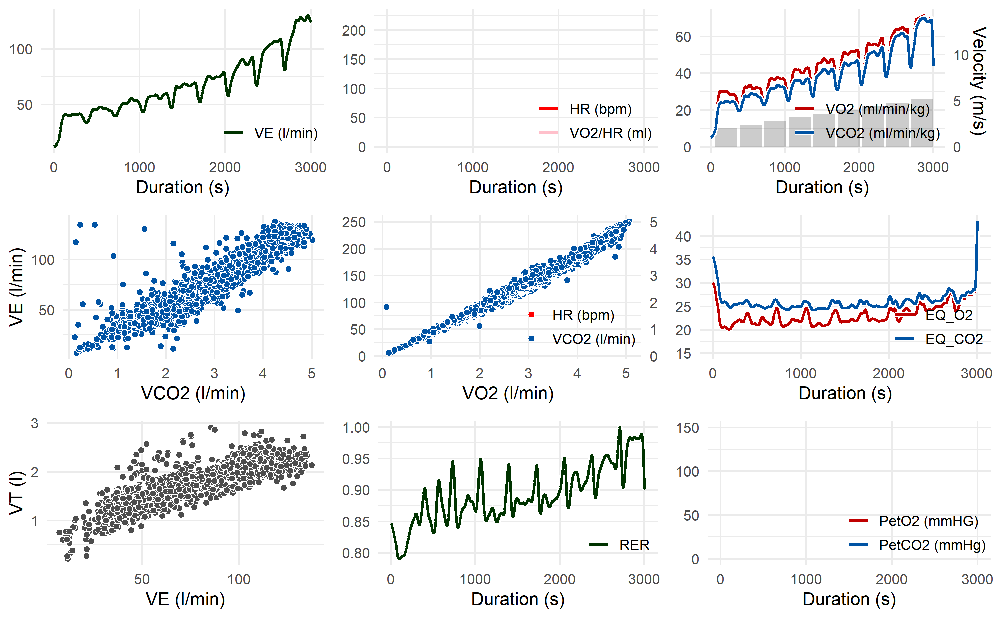

<!-- README.md is generated from README.Rmd. Please edit that file -->

# spiro

The goal of `spiro` is to enable a fast workflow with raw files from
metabolic carts/spiroergometry systems. It provides simple tools for
data import,processing, summary and visualisation.

## Installation

Install the current development version from GitHub

``` r
# install.packages("devtools")
devtools::install_github("smnnlt/spiro")
```

## Usage

-   Use `spiro()` for one-step data import and processing from raw
    metabolic cart files.
-   Use `spiro_summary()` and `spiro_glance()` for getting a stepwise or
    overall summary of the imported data.
-   Use `spiro_plot_*()` as a shortcut for visualising the imported
    data.

#### Metabolic Carts

The following metabolic carts are currently supported by `spiro`:

-   ZAN

## Example

``` r
library(spiro)

# setup data for example
file <- spiro_example("zan_gxt")

gxt_data <- spiro(file)
spiro_summary(gxt_data)
#>    step_number load     VO2    VCO2  RER VO2_rel     RE
#> 1            0  0.0  448.40  371.06 0.83    6.79     NA
#> 2            1  2.0 1870.23 1578.40 0.84   28.34 236.14
#> 3            2  2.4 2136.67 1810.46 0.85   32.37 224.82
#> 4            3  2.8 2394.29 2050.63 0.86   36.28 215.93
#> 5            4  3.2 2706.73 2322.97 0.86   41.01 213.60
#> 6            5  3.6 2996.84 2629.97 0.88   45.41 210.22
#> 7            6  4.0 3399.38 3066.69 0.90   51.51 214.61
#> 8            7  4.4 3767.31 3452.89 0.92   57.08 216.21
#> 9            8  4.8 4166.25 3901.88 0.94   63.13 219.18
#> 10           9  5.2 4495.18 4386.05 0.98   68.11 218.30

spiro_plot_VO2(gxt_data)
```


